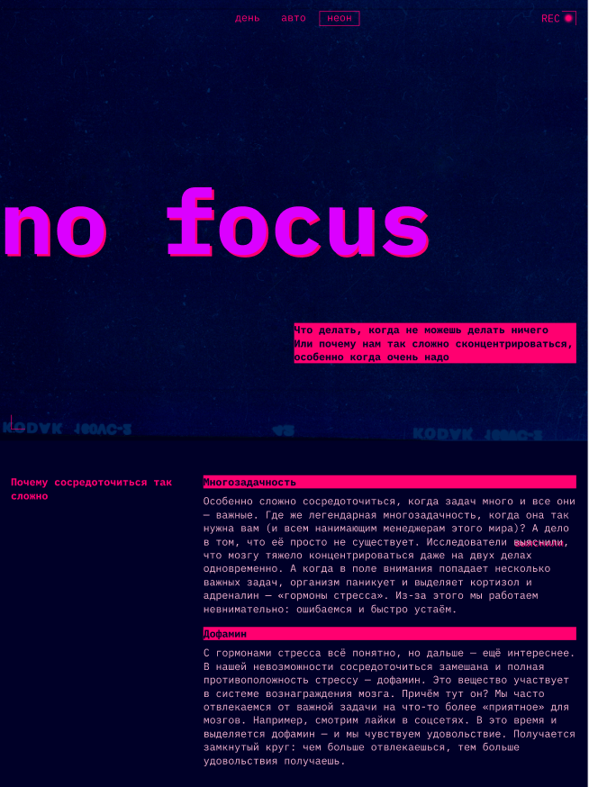
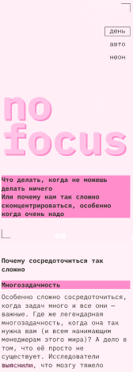

# [Проект "Сложно сосредоточиться"](https://slozhno-sosredotochitsya.vercel.app/)

*[Челлендж с сайта Frontend Mentor](https://www.frontendmentor.io/home)

### Обзор

Привет! Это статический проект с темизацией, адаптивной и резиновой версткой, который предоставляет советы и рекомендации о том, как сосредоточиться. Проект выполнен с использованием HTML, CSS и JavaScript.

### Скриншоты

### Ссылки

- [Live site URL](https://slozhno-sosredotochitsya.vercel.app/) - Сайт

### Используемые технологии

- JavaScript
- Адаптивная верстка
- Семантическая верстка HTML5
- Кастомные свойства CSS
- Flexbox
- CSS Grid